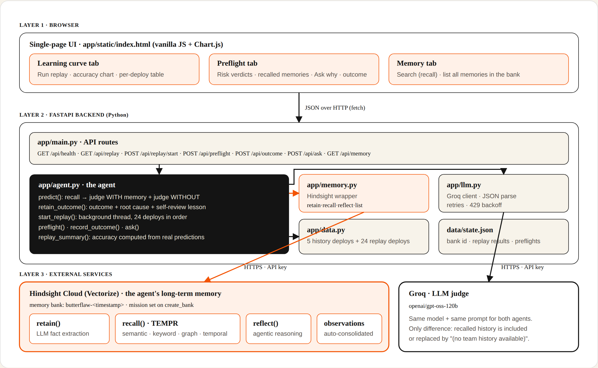
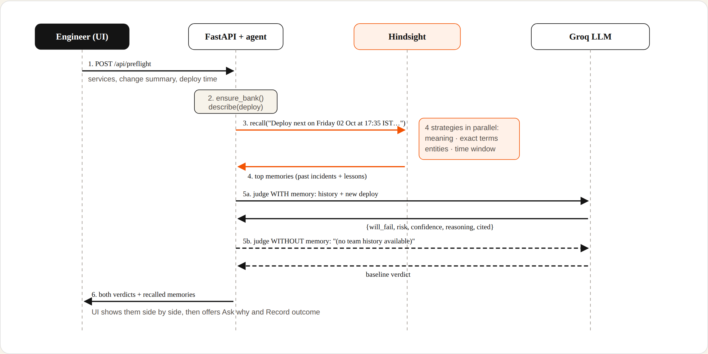
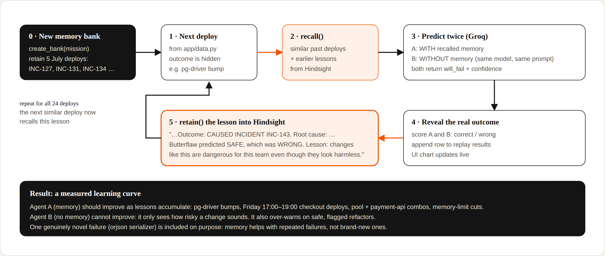
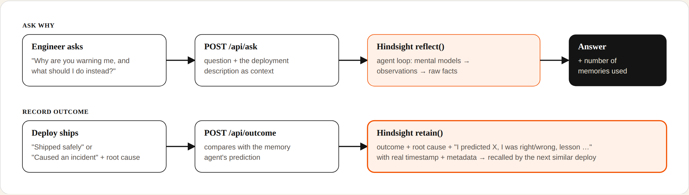
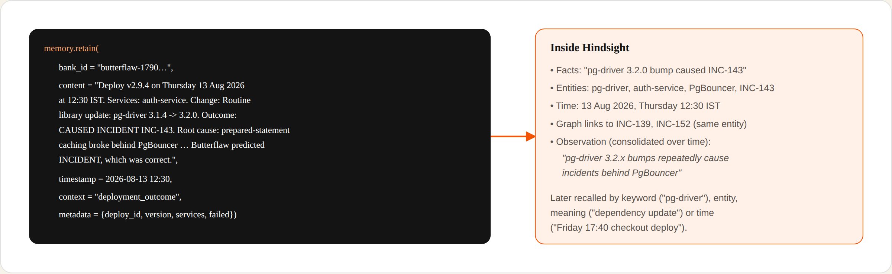

# Butterflaw 🦋

**Every outage starts with a wing flap.**

Butterflaw is a DevOps agent that predicts whether a deployment will break production, using a memory of every past deployment your team has shipped. It remembers which changes caused incidents, why they failed, and where its own predictions went wrong. The memory layer is [Hindsight](https://github.com/vectorize-io/hindsight) by Vectorize.

| | |
|---|---|
| 🌐 **Live demo** | https://butterflaw.onrender.com |
| 🎥 **Demo video** | https://youtu.be/IxmwrdX9YUE |
| 🎬 **Workflow video** | https://youtu.be/m1nqtu45uUw |
| 📝 **Article** | [I Gave My Deploy Pipeline Hindsight Memory. Outages Stopped Repeating.](https://dev.to/jaividhyarthi/i-gave-my-deploy-pipeline-hindsight-memory-outages-stopped-repeating-4956) |
| 💼 **LinkedIn** | [Post](https://www.linkedin.com/posts/jaividhyarthivivekanand_aiagents-agentmemory-hindsight-share-7510749692083785728-SEXS/) |
| 💬 **Reddit** | [r/SideProject discussion](https://www.reddit.com/r/SideProject/comments/1wtg97d/i_gave_my_deploy_agent_a_memory_same_llm_1724/) |

## Results

Same LLM (`openai/gpt-oss-120b` on Groq), same prompt, 24 deployments replayed in order. Each agent predicts **before** seeing the outcome.

| Agent | Correct | Accuracy |
|---|---|---|
| **With Hindsight memory** | **17 / 24** | **71%** |
| Without memory | 11 / 24 | 46% |

Wherever the two agents disagreed, the memory agent was the one that was right. It caught 6 incidents the baseline called safe (INC-142, INC-143, INC-147, INC-152, INC-156, INC-163). **The honest limit:** on two Friday-evening deploys, memory recalled the right incidents but the model argued itself out of them, and a novel `orjson` failure was missed by both. Recall is not the same as judgment.

## Architecture



<details>
<summary><b>Preflight flow: "Seen this before?"</b></summary>


</details>

<details>
<summary><b>The learning loop (replay)</b></summary>


</details>

<details>
<summary><b>Ask why + recording outcomes</b></summary>


</details>

<details>
<summary><b>What one memory looks like</b></summary>


</details>

Interactive version of all diagrams: [`docs/architecture/butterflaw_architecture.html`](docs/architecture/butterflaw_architecture.html) (download and open in a browser).

## The problem

Teams keep repeating the same failures. A config change shipped with a service update breaks checkout in July, and the same combination breaks it again in October. The knowledge of *why* things broke sits in people's heads, scattered CI logs and old Slack threads. CI tools report a failure after it happens; they never learn from it.

Generic reasoning doesn't catch these failures either. They are **team-specific**:

- `pg-driver 3.2` looks like a routine dependency bump, but it breaks behind *this* team's PgBouncer setup.
- A two-line checkout fix is harmless on Wednesday, but on **Friday 17:00–19:00** it collides with the weekly price-sync job.
- A 1,400-line refactor looks terrifying, yet it's safe because this team ships dark behind feature flags.

An LLM can't know any of this. A memory can.

## How it works

```
             ┌──────────────────────────────────────────────┐
 new deploy ─┤ 1. recall()  similar past deploys + lessons  │── Hindsight memory bank
             │ 2. LLM judge (Groq) with recalled history    │
             │ 3. same LLM judge WITHOUT memory (baseline)  │
             └───────────────┬──────────────────────────────┘
                             │ real outcome arrives
                             ▼
             4. retain()  outcome + root cause + "I was right / wrong, lesson: ..."
             5. reflect() answers "why are you warning me?" over the whole memory
```

**Two agents, one difference.** Both use the same LLM (`openai/gpt-oss-120b` on Groq) and the same prompt. The only difference is that one of them gets the team's history from Hindsight `recall()`. That isolates exactly what memory adds.

## How Butterflaw uses Hindsight

All long-term memory lives in Hindsight. There is no local vector store, no embeddings, no similarity code.

| Operation | Where | What it does |
|---|---|---|
| `create_bank` | `app/memory.py` | One bank per team, with a mission describing what Butterflaw should remember |
| `retain` | `app/agent.py → retain_outcome()` | Stores each deployment outcome with its real timestamp, services, root cause, and a **self-review**: what Butterflaw predicted, whether that was right, and the lesson if it was wrong |
| `recall` | `app/agent.py → predict()` | Before every prediction, retrieves similar past deployments. Hindsight's semantic, keyword, entity-graph and **temporal** retrieval matter here: "Friday 17:40 checkout deploy" matches earlier Friday-evening incidents by time, and `pg-driver` matches by exact term |
| `reflect` | `app/agent.py → ask()` | The "Ask Butterflaw" box. Reasons over the whole memory bank to explain a warning and suggest what to do instead |
| `list_memories` | Memory tab | Shows everything the agent knows, including consolidated observations |

The **learning loop** is the core of the design: predict → ship → retain the real outcome plus a lesson → recall that lesson next time.

## The replay: watching it learn

The Learning curve tab replays 24 deployments from an Indian e-commerce team (Aug–Sep 2026) in chronological order. For each deployment:

1. Both agents predict **before** seeing the outcome.
2. The real outcome is retained into Hindsight.
3. Accuracy is plotted cumulatively for both agents.

All accuracy numbers are computed from the actual predictions made during the run. Nothing is hardcoded. Results vary slightly between runs because they come from a live LLM.

**About the data.** The deployment history (`app/data.py`) is synthetic but realistic. It contains planted team-specific patterns (pg-driver bumps, Friday-evening checkout deploys, pool changes shipped with payment-api, memory-limit cuts on inventory-service), safe practices that look scary (feature-flag dark launches, canaries, expand/contract migrations), and one genuinely novel failure that no memory could predict. The memoryless agent has to rely on how risky a change *sounds*; the memory agent learns how risky it *is for this team*.

## Run it

```bash
git clone https://github.com/Jaividhyarthi/Butterflaw.git
cd Butterflaw
cp .env.example .env        # add your HINDSIGHT_API_KEY and GROQ_API_KEY
pip install -r requirements.txt
uvicorn app.main:app --host 0.0.0.0 --port 8000
```

Open http://localhost:8000.

- **Hindsight Cloud key:** https://ui.hindsight.vectorize.io → Connect → Create API Key
- **Groq key:** https://console.groq.com → API Keys

Then:

1. **Learning curve** → *Run replay with fresh memory* (takes a few minutes: each step recalls, predicts twice, and retains)
2. **Preflight** → describe a deployment and compare the verdicts with and without memory. Ask why, then record the outcome so it's learned.
3. **Memory** → search or list what Butterflaw has learned

## Project structure

```
docs/architecture/   architecture and flow diagrams (PNG + HTML)
app/
  main.py      FastAPI routes
  agent.py     prediction, replay, learning loop
  memory.py    Hindsight wrapper (retain / recall / reflect / list)
  llm.py       Groq client with JSON parsing, retries and rate-limit backoff
  data.py      team deployment history + replay set
  static/index.html   single-page UI (Chart.js)
```

## Limitations and next steps

- Deployments are entered by hand or replayed. The next step is a GitHub Actions hook that runs a preflight on every pull request and retains the CI and deploy result automatically.
- Replay runs sequentially because each prediction must see the previous outcome.
- Confidence values come from the LLM and are not calibrated.

## Links

- Hindsight on GitHub: https://github.com/vectorize-io/hindsight
- Hindsight docs: https://hindsight.vectorize.io/
- What is agent memory: https://vectorize.io/what-is-agent-memory
